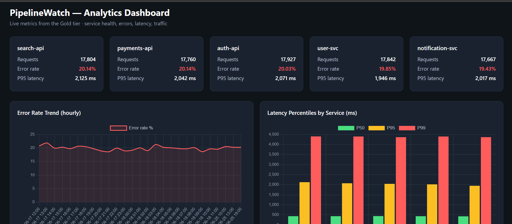

# PipelineWatch

🔗 **[Live Dashboard](https://krishnamunjeti99.github.io/pipelinewatch/dashboard/)** · 📐 **[System Design](docs/ARCHITECTURE.md)**

**An end-to-end AWS data platform — from raw event logs to a live analytics dashboard.**

PipelineWatch is a self-directed data engineering project that implements a complete, production-style **medallion lakehouse** on AWS: synthetic application telemetry is ingested to a raw tier, cleaned and transformed with PySpark, modelled into business marts with dbt, orchestrated end-to-end with Apache Airflow, and surfaced in an interactive analytics dashboard. Every piece of infrastructure is defined as code.

The project demonstrates the full data lifecycle — **ingestion → transformation → analytics engineering → orchestration → serving** — using the same tools and patterns used by modern data teams.

> **Stack:** Python · PySpark · AWS (S3, Glue, Athena, IAM) · dbt · Terraform · Apache Airflow · FastAPI · Chart.js · Docker

---

## Dashboard

The serving layer reads the curated Gold marts and presents service health, error trends, latency percentiles, and user activity at a glance.



*Live analytics served by FastAPI from pre-aggregated Gold marts, queried through Athena and rendered with Chart.js.*

---

## Architecture

PipelineWatch follows the **medallion architecture** — data flows through progressively refined tiers, each with a clear purpose.

```
                          ┌──────────────────────────────────────────────┐
                          │            Apache Airflow (DAG)               │
                          │   orchestrates the full pipeline on schedule  │
                          │   with dependencies, retries, and alerting    │
                          └──────────────────────────────────────────────┘
                                 │           │           │           │
                                 ▼           ▼           ▼           ▼
   ┌──────────┐   generate   ┌────────┐  ┌────────┐  ┌─────────┐  ┌──────────┐
   │ Synthetic│ ───────────► │ BRONZE │  │ Glue   │  │ Crawler │  │   dbt    │
   │   logs   │   (Python)   │  raw   │─►│PySpark │─►│ catalog │─►│  build   │
   └──────────┘              │  JSON  │  │ job    │  └─────────┘  │  (Gold)  │
                             └────────┘  └────────┘               └──────────┘
                                  │           │                        │
                              S3 (raw)    S3 SILVER                  S3 GOLD
                                          cleaned,                 business
                                          partitioned              marts +
                                          Parquet                  SCD2 dim
                                                                       │
                                                                       ▼
                                                            ┌────────────────────┐
                                                            │  FastAPI + Chart.js│
                                                            │  analytics         │
                                                            │  dashboard         │
                                                            │  (reads Gold via   │
                                                            │   Athena)          │
                                                            └────────────────────┘

   All infrastructure provisioned as code with Terraform · queryable throughout with Athena
```

| Tier | Purpose | Format | Built with |
|------|---------|--------|-----------|
| **Bronze** | Raw, immutable ingestion | JSON, partitioned | Python generator, S3, Terraform |
| **Silver** | Cleaned, typed, deduplicated | Parquet, partitioned | PySpark on AWS Glue |
| **Gold** | Business-ready marts & dimensions | Parquet / Iceberg | dbt (Athena adapter) |
| **Serving** | Interactive analytics | Web dashboard | FastAPI, Chart.js |

---

## What this project demonstrates

**Data engineering** — batch ingestion, distributed transformation with PySpark, partitioning and columnar storage for query efficiency, idempotent and reproducible pipelines, and infrastructure as code.

**Analytics engineering** — dbt models with a clean staging → marts structure, automated data-quality tests, slowly changing dimensions (SCD Type 2), and generated lineage documentation.

**Analytics & SQL** — analytical SQL behind real metrics (error rates, P50/P95/P99 latency percentiles, daily active users, hourly trends), surfaced in a dashboard built for at-a-glance insight.

**Orchestration & DevOps** — a single Airflow DAG running the full pipeline with dependencies, retries, and failure alerting; everything containerised and defined as code for reproducibility.

---

## Tech stack

| Area | Technologies |
|------|-------------|
| **Languages** | Python, SQL |
| **Processing** | Apache Spark (PySpark), AWS Glue 5.0 |
| **Storage & query** | Amazon S3, AWS Glue Data Catalog, Amazon Athena, Apache Parquet, Apache Iceberg |
| **Transformation** | dbt (dbt-athena adapter) |
| **Orchestration** | Apache Airflow 3 (Astronomer runtime, Docker) |
| **Serving** | FastAPI, pyathena, Pandas, Chart.js |
| **Infrastructure** | Terraform, Docker, IAM |
| **Tooling** | Git, uv, systemd, WSL2 |

---

## Pipeline stages

### 1 · Ingestion (Bronze)
A Python generator produces realistic synthetic application telemetry — events with service, endpoint, status code, latency, user, and region, including a realistic error rate. Data lands in an S3 Bronze tier, partitioned by service and time. The three-bucket data lake (Bronze / Silver / Gold) is provisioned with Terraform, including versioning, public-access blocking, and lifecycle rules.

### 2 · Transformation (Silver)
A PySpark job — developed locally, then deployed to **AWS Glue 5.0** — reads the raw JSON with an explicit schema, parses timestamps, derives analytical columns, applies data-quality filters, and **deduplicates on event ID for idempotency**. The output is partitioned, compressed Parquet. A Glue crawler registers it in the Data Catalog, making it queryable through Athena.

### 3 · Analytics engineering (Gold)
**dbt** (with the Athena adapter) transforms the Silver data into business-ready marts:
- `mart_service_hourly_kpis` — volume, error rate, and latency percentiles per service per hour
- `mart_daily_active_users` — distinct users and request volume per day
- `mart_error_analytics` — error breakdown by service, endpoint, and status code
- `users_snapshot` — a **slowly changing dimension (SCD Type 2)** tracking user-attribute history, implemented as an Iceberg table

The project includes generic and custom **data tests** and generated **lineage documentation**.

### 4 · Orchestration (Airflow)
A single Airflow DAG runs the entire pipeline end to end — generate → Glue transform → crawl → dbt build — in dependency order, with per-task **retries** and a **failure-alert callback**. Airflow runs locally in Docker (via the Astronomer runtime) and orchestrates the remote AWS services, with dbt isolated in its own virtual environment to avoid dependency conflicts.

### 5 · Serving (Dashboard)
A **FastAPI** backend queries the Gold marts through Athena and serves analytics as JSON; a **Chart.js** dashboard renders service-health cards, an error-rate trend line, latency-percentile bars, and an active-users chart. Query results are **cached in memory** with a short TTL for responsiveness and lower query cost.

---

## Repository structure

```
pipelinewatch/
├── ingestion/            # Synthetic log generator (Python)
├── infra/                # Terraform — S3 data lake, Glue, IAM
│   ├── modules/
│   └── environments/dev/
├── transformations/
│   ├── spark_jobs/       # PySpark Bronze → Silver (local + Glue)
│   └── dbt/              # dbt project — staging, marts, snapshot, tests
├── orchestration/        # Airflow project (Astronomer) — the pipeline DAG
│   └── dags/
├── serving/              # FastAPI + Chart.js analytics dashboard
│   └── app/
└── docs/                 # Documentation, screenshots, learning notes
```

---

## Running it locally

> Requires AWS credentials, Terraform, Docker, Python 3.12, and the dbt-athena and Astronomer CLIs. The AWS resources cost only a few cents per run (Glue + Athena), and Airflow runs free in Docker.

```bash
# 1. Provision the data lake and Glue resources
cd infra/environments/dev
terraform init && terraform apply

# 2. Generate data into the Bronze tier
python ingestion/batch_generator/generate_logs.py <bronze-bucket> --backfill 24

# 3. Build the Gold tier with dbt
cd transformations/dbt
dbt build

# 4. Orchestrate the whole pipeline with Airflow
cd orchestration
astro dev start          # Airflow UI at the printed localhost URL

# 5. Launch the analytics dashboard
cd serving
fastapi dev app/main.py  # dashboard at http://127.0.0.1:8000
```

---

## Engineering decisions & highlights

- **Local-first development** — the PySpark transformation is developed and tested locally before deploying the identical logic to Glue, making iteration fast and free.
- **Idempotency throughout** — deduplication on event ID and deterministic transformations make every stage safe to re-run, which is what allows Airflow to retry failed tasks without corrupting data.
- **Cost-conscious by design** — ephemeral Glue jobs (no idle cost), Athena over partitioned Parquet (minimal data scanned), local Airflow instead of managed MWAA, and dashboard caching. Total running cost is a fraction of a dollar per month.
- **dbt isolated in Airflow** — dbt's dependencies conflict with Airflow's, so it runs in a dedicated virtual environment invoked from the DAG — a clean, real-world pattern.
- **Infrastructure as code** — the entire data lake and Glue setup is reproducible from Terraform; the project can be rebuilt from scratch.

---

## Notes

This is a self-directed portfolio project built to demonstrate end-to-end data engineering, analytics engineering, and orchestration on AWS. It uses synthetic data so the full pipeline can run safely and cheaply, while exercising the same tools, patterns, and design trade-offs as a production system.

**Author:** Sai Krishna Munjeti · [GitHub](https://github.com/krishnamunjeti99)
